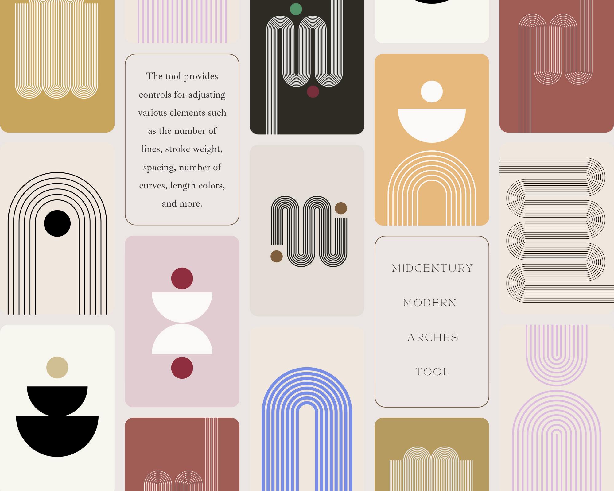
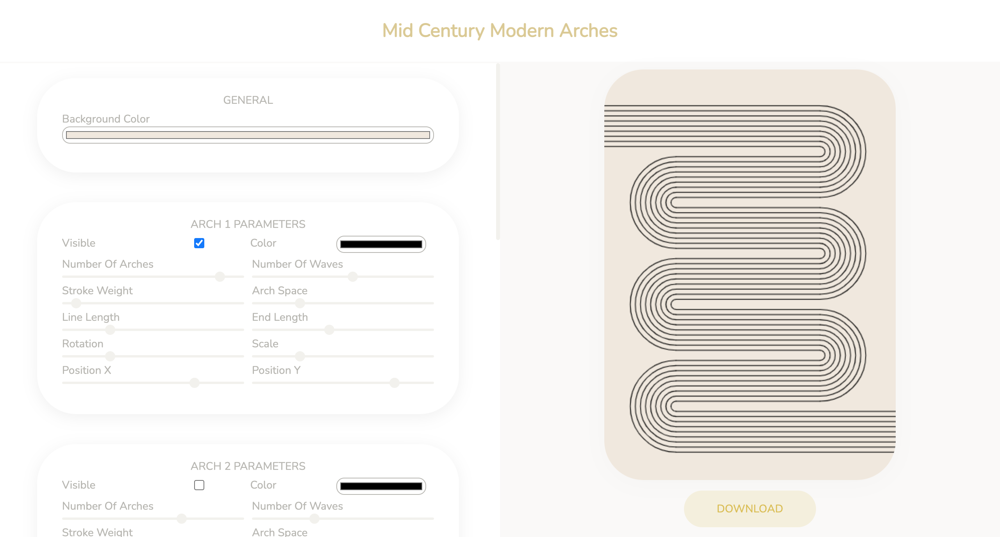

# Mid Century Modern Arches

This repository provides a powerful web tool for creating captivating Mid Century Modern arches prints. Inspired by the iconic architectural style of the mid-20th century, this tool allows you to generate unique arches designs by manipulating a range of customizable parameters. With the help of p5.js framework, the canvas is dynamically rendered in real-time, enabling you to visualize and fine-tune the print according to your preferences.

In the creative process you can experiment with various elements such as the number of lines, stroke weight, spacing, number of curves, and length. Tailor the arches to your liking, giving them a distinct character that reflects the essence of the Mid Century Modern aesthetic. You also have the ability to enhance your design by seamlessly incorporating circles or semicircles. With this tool, users can easily create custom designs for a variety of purposes, such as backgrounds for websites, desktop wallpapers, or artistic projects. 

## Getting Started

To get started, simply open the ´index.html´ file in your web browser and begin adjusting the parameters using the sliders and buttons provided. You can also save your favorite patterns by clicking the "Download" button, which will generate a PNG image file that you can download and use as desired.

## Usage

The GUI provides a range of customizable parameters for generating the design. Users have the flexibility to add up to 6 elements in total, with a maximum of 2 elements for each type of geometry. The parameters for the three different geometry types are as follows:

#### Arch
- Color: Sets the color for the arches.
- Number Of Arches: Specifies the quantity of arches in the design.
- Number Of Waves: Controls the number of waves within each arch.
- Stroke Weight: Adjusts the thickness of the lines composing the arches.
- Arch Space: Defines the spacing between each arch.
- Line Length: Determines the length of the individual lines forming the arches.
- End Length: Specifies the length of the endpoints of the arches,.
- Rotation: Rotates the arches.
- Scale: Alters the size of the arches.
- Position X: Controls the horizontal placement of the arches within the canvas.
- Position Y: Determines the vertical placement of the arches within the canvas.

#### Circle
- Color: Specifies the color palette for the circles,.
- Position X: Determines the horizontal placement of the circles within the canvas.
- Position Y: Controls the vertical placement of the circles within the canvas.
- Radius: Sets the size of the circles.

#### Semicircle
- Color: Specifies the color palette for the semicircles.
- Position X: Determines the horizontal placement of the semicircles within the canvas.
- Position Y: Controls the vertical placement of the semicircles within the canvas.
- Radius: Sets the size of the semicircles.
- Rotation: Rotates the semicircles.
